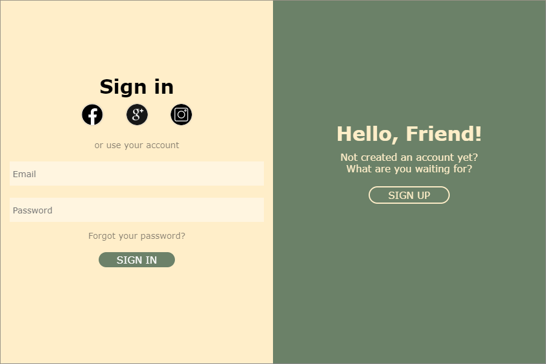

Hi there!
A small project on which I practiced layout and js

### Description

when you click the sign in/sign up button, depending on the current window, the position of the blocks changes and a new form is shown

### Screenshot

Start form 

Switched form 
